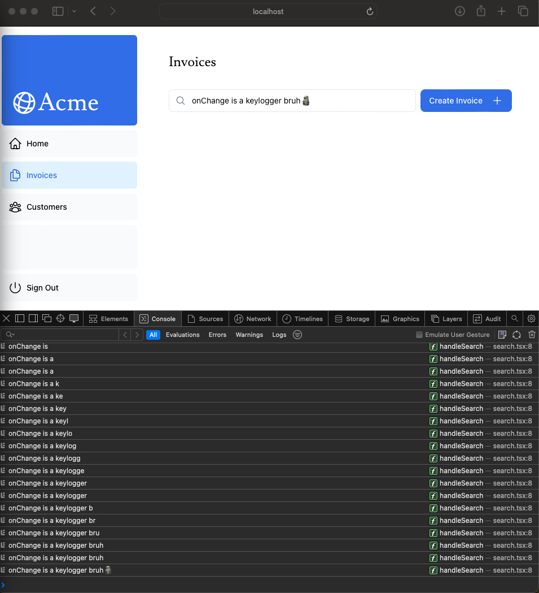

# Full-Stack Dashboard
Next.js App Router course. A simplified version of the financial dashboard that has:

- A public home page.
- A login page.
- Dashboard pages that are protected by authentication.
- The ability for users to add, edit, and delete invoices.
- The dashboard will also have an accompanying database.


### Carl's Notes
_____

We use clsx to conditionally apply the classes.

[Cumulative Layout Shift](https://web.dev/articles/cls) is a metric used by Google to evaluate the performance and user experience of a website. With fonts, layout shift happens when the browser initially renders text in a fallback or system font and then swaps it out for a custom font once it has loaded. This swap can cause the text size, spacing, or layout to change, shifting elements around it.

_____
Using `` instead of `<Image />` means you have to manually:

Ensure your image is responsive on different screen sizes.
Specify image sizes for different devices.
Prevent layout shift as the images load.
Lazy load images that are outside the user's viewport.
Image Optimization is a large topic in web development that could be considered a specialization in itself.

_____

**Nested Routing**
Next.js uses file-system routing where folders are used to create nested routes. Each folder represents a route segment that maps to a URL segment.


To create a new page, make a folder under `app/`. Inside folder, create a `page.tsx`. Name of page is name of folder.

_____

`/app/layout.tsx` is called a root layout and is required. Any UI you add to the root layout will be shared across all pages in your application. You can use the root layout to modify your <html> and <body> tags, and add metadata (you'll learn more about metadata in a later chapter).

`layout` in other nested folders are glocal

_____

`<Link>` allows you to do client-side navigation with JavaScript. Seamless pageloading!

To improve the navigation experience, Next.js automatically code splits your application by route segments. This is different from a traditional React SPA, where the browser loads all your application code on initial load.

Splitting code by routes means that pages become isolated. If a certain page throws an error, the rest of the application will still work.

_____

run `npm i @vercel/postgres` in your terminal to install the Vercel Postgres SDK.

____

What's one advantage of using React Server Components to fetch data?
> Server components allow you fetch data directly from your database.

____

Inline SQL syntax

```
const invoiceCountPromise = sql`SELECT COUNT(*) FROM invoices`;
```
____

Network request waterfalls: Sequential vs Parallel


Right now, it is waterfall. This pattern is not necessarily bad. There may be cases where you want waterfalls because you want a condition to be satisfied before you make the next request. For example, you might want to fetch a user's ID and profile information first. Once you have the ID, you might then proceed to fetch their list of friends. In this case, each request is contingent on the data returned from the previous request.

However, this behavior can also be unintentional and impact performance.

_____

Static vs Dynamic Rendering


Static rendering is useful for UI with no data or data that is shared across users, such as a static blog post or a product page. It might not be a good fit for a dashboard that has personalized data that is regularly updated.

> I assume lazy load is under `Static`

_____

Streaming is a data transfer technique that allows you to break down a route into smaller "chunks" and progressively stream them from the server to the client as they become ready.


_____

Route Grouping


Route groups allow you to organize files into logical groups without affecting the URL path structure. When you create a new folder using parentheses (), the name won't be included in the URL path. So /dashboard/(overview)/page.tsx becomes /dashboard.

Here, you're using a route group to ensure loading.tsx only applies to your dashboard overview page. However, you can also use route groups to separate your application into sections (e.g. (marketing) routes and (shop) routes) or by teams for larger applications.


_____

Suspense! **Important**


Suspense allows you to defer rendering parts of your application until some condition is met (e.g. data is loaded). You can wrap your dynamic components in Suspense. Then, pass it a fallback component to show while the dynamic component loads.
_____

Combining Static / Dynamic Content


Most routes are not fully static or dynamic. You may have a route that has both static and dynamic content. For example, consider an ecommerce site. You might be able to prerender the majority of the product page, but you may want to fetch the user's cart and recommended products dynamically on-demand.

Suspense allows you to defer rendering parts of your application until some condition is met (e.g. data is loaded). You can wrap your dynamic components in Suspense. Then, pass it a fallback component to show while the dynamic component loads.


> Holes are locations where dynamic content will load asynchronously at request time.

The great thing about Partial Prerendering is that you don't need to change your code to use it. As long as you're using Suspense to wrap the dynamic parts of your route, Next.js will know which parts of your route are static and which are dynamic.
_____

Benefits of implementing search with URL params:

1. Bookmarkable and Shareable URLs: Since the search parameters are in the URL, users can bookmark the current state of the application, including their search queries and filters, for future reference or sharing.
2. Server-Side Rendering and Initial Load: URL parameters can be directly consumed on the server to render the initial state, making it easier to handle server rendering.
3. Analytics and Tracking: Having search queries and filters directly in the URL makes it easier to track user behavior without requiring additional client-side logic.

via:
- `useSearchParams` - Allows you to access the parameters of the current URL. For example, the search params for this URL /dashboard/invoices?page=1&query=pending would look like this: {page: '1', query: 'pending'}.
- `usePathname` - Lets you read the current URL's pathname. For example, for the route /dashboard/invoices, usePathname would return '/dashboard/invoices'.
- `useRouter` - Enables navigation between routes within client components programmatically.

`onChange` will invoke handleSearch whenever the input value changes.


URLSearchParams is a Web API that provides utility methods for manipulating the URL query parameters. Instead of creating a complex string literal, you can use it to get the params string like `?page=1&query=a`.

**Best Practice: Debouncing**
> Debouncing is a programming practice that limits the rate at which a function can fire. In our case, you only want to query the database when the user has stopped typing.

How Debouncing Works:

1. Trigger Event: When an event that should be debounced (like a keystroke in the search box) occurs, a timer starts.
2. Wait: If a new event occurs before the timer expires, the timer is reset.
3. Execution: If the timer reaches the end of its countdown, the debounced function is executed.
_____


_____